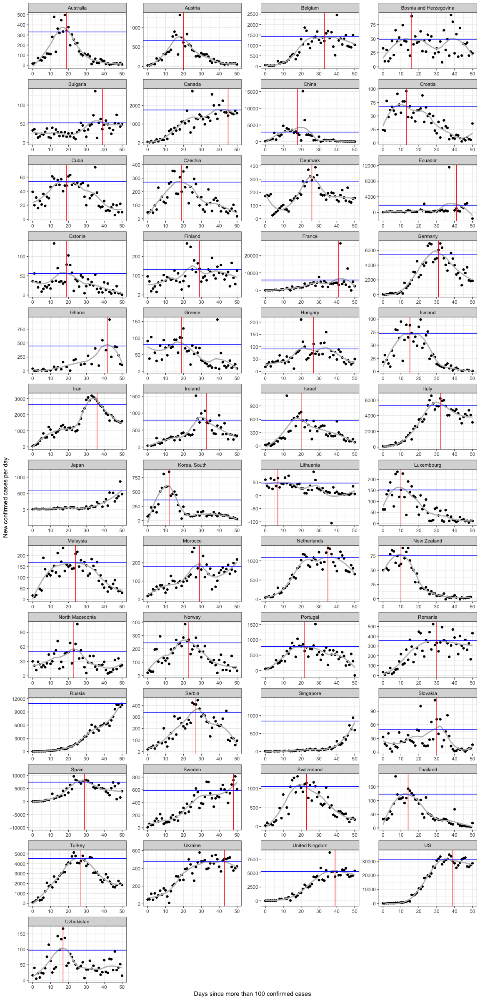

  


# Covid-19 pandemia days to peak
## Download data

Data were downloaded from the github repository of the Johns Hopkins University. These are the same data, from which the famous GIS world map is created.
See: [https://github.com/CSSEGISandData/COVID-19] (https://github.com/CSSEGISandData/COVID-19)


This was last updated


```
## [1] "2020-05-26"
```


The minimum number of confirmed cases to be taken into account to allow for senseful fit

```
## [1] 1500
```


country                 maxday
---------------------  -------
Bahrain                     78
Qatar                       77
Brazil                      75
Iraq                        75
Egypt                       74
India                       74
Kuwait                      74
Philippines                 74
Poland                      74
Saudi Arabia                74
Indonesia                   73
Chile                       72
Pakistan                    72
Peru                        71
Mexico                      70
South Africa                70
United Arab Emirates        70
Armenia                     69
Colombia                    69
Panama                      69
Argentina                   68
Algeria                     67
Dominican Republic          67
Moldova                     65
Azerbaijan                  62
Oman                        62
Senegal                     62
Afghanistan                 61
Cote d'Ivoire               61
Kazakhstan                  61
Cameroon                    59
Honduras                    59
Nigeria                     59
Belarus                     58
Bolivia                     57
Singapore                   57
Congo (Kinshasa)            56
Japan                       55
Russia                      55
Bangladesh                  51
Guinea                      51
Djibouti                    48
El Salvador                 48
Sweden                      48
Guatemala                   47
Canada                      45
Ukraine                     43
Ghana                       42
Ecuador                     41
France                      41

<!-- -->


